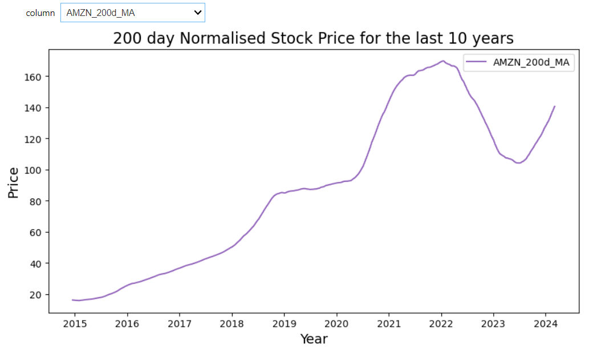
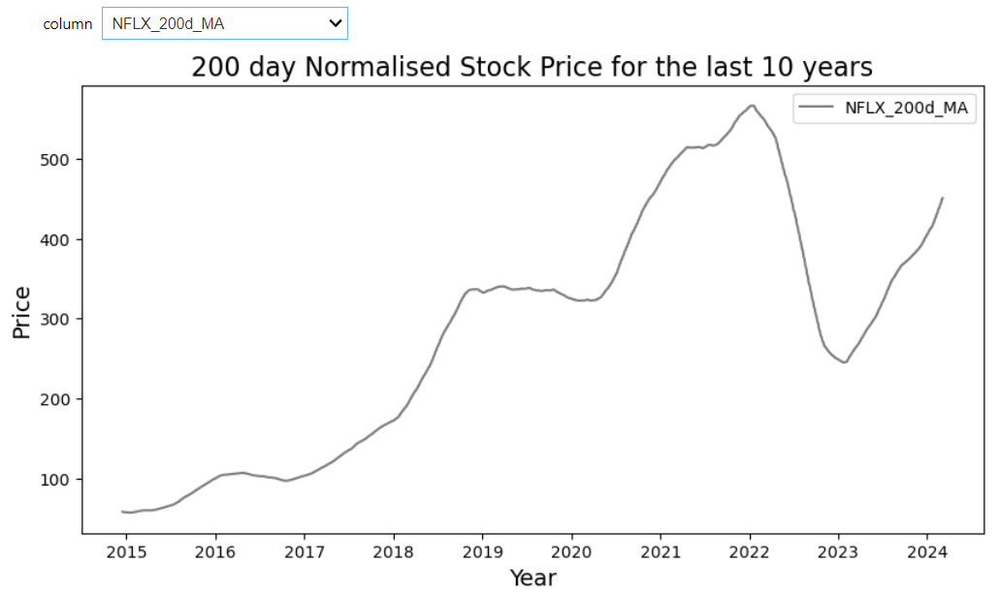
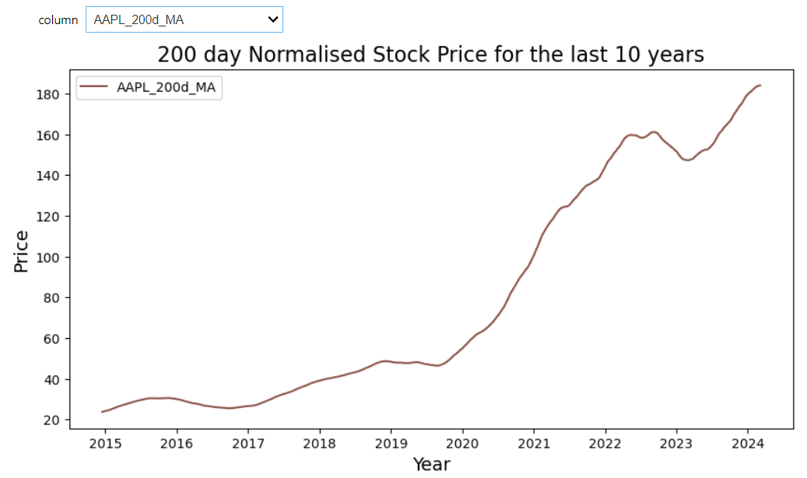

# Project 3 - A Tech Stock Buyer's Guide
### Project completed by - Tyson Horsewell, Husna Nasution & Bilal Rasheed

This project aims to emulate a scenario where a financial magazine or another publication conducts an investigation on some of the most prominent tech companies working today, these being: Meta, Amazon, Netflix and Apple (AKA MANA). The goal of this investigation would be to provide potential investors accurate, easy-to-understand information provided through graphs of the recent history of MANA on the stock market.

We aim to produce 3 graphs to provide potential investors this information:
1. The performance of MANA over the last 10 years
2. The month-to-month variance of MANA over the last 10 years
3. The relationship between stock volume and stock price of MANA

These graphs were chosen as we believe they would provide potential investors a clear insight into the kinds of patterns they can look for in order to know when the best possible time to invest in a company would be to potentially earn a return on the investment. In order to assist viewers in making the choice that is right for them, our graphs will include (where appropriate) some features that would make analysing the graphs easier. These inclusions include: trendlines, averages, volume analysis and bollinger bands.

1. The performance of MANA over the last 10 years:
Here is an analysis of MANA's price movement over the past decade starting from 5th of March 2014 to 5th March 2024. We used Yahoo Finance for the data and made sure it didn't have any missing information using the 'data.isnull().sum()' command.
To see how the closing price move overtime, we created an interactive line graph. We used Jupyter Notebook, along with matplotlib and ipywidgets to the interactive line graph.

Take a look at the graph to see how MANA has performed:

